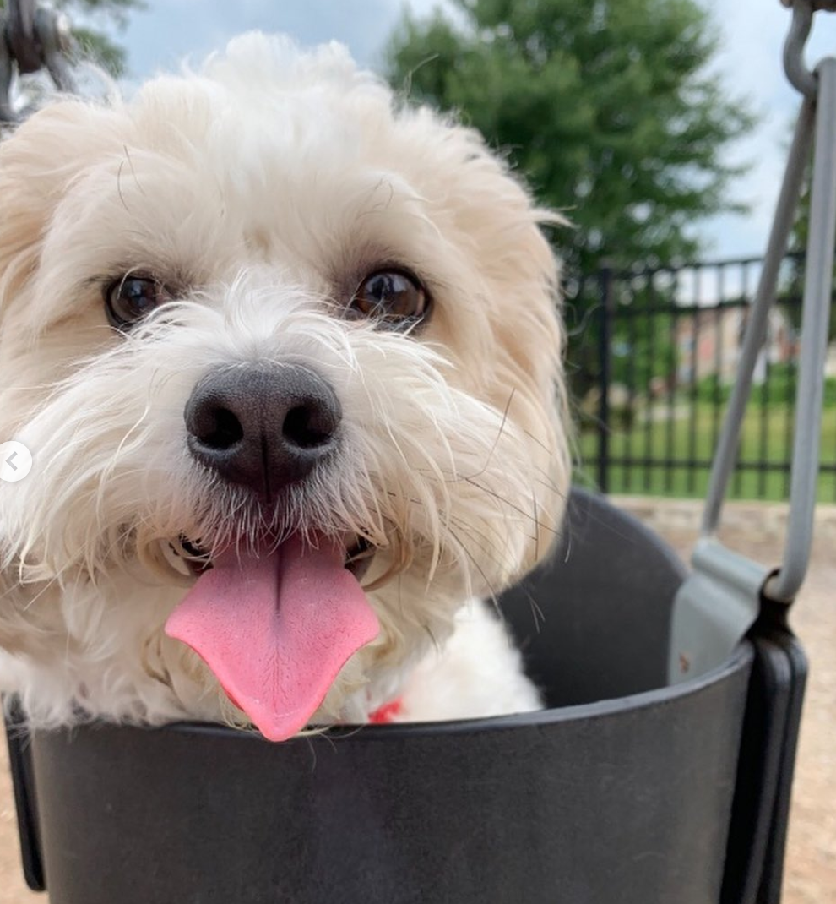
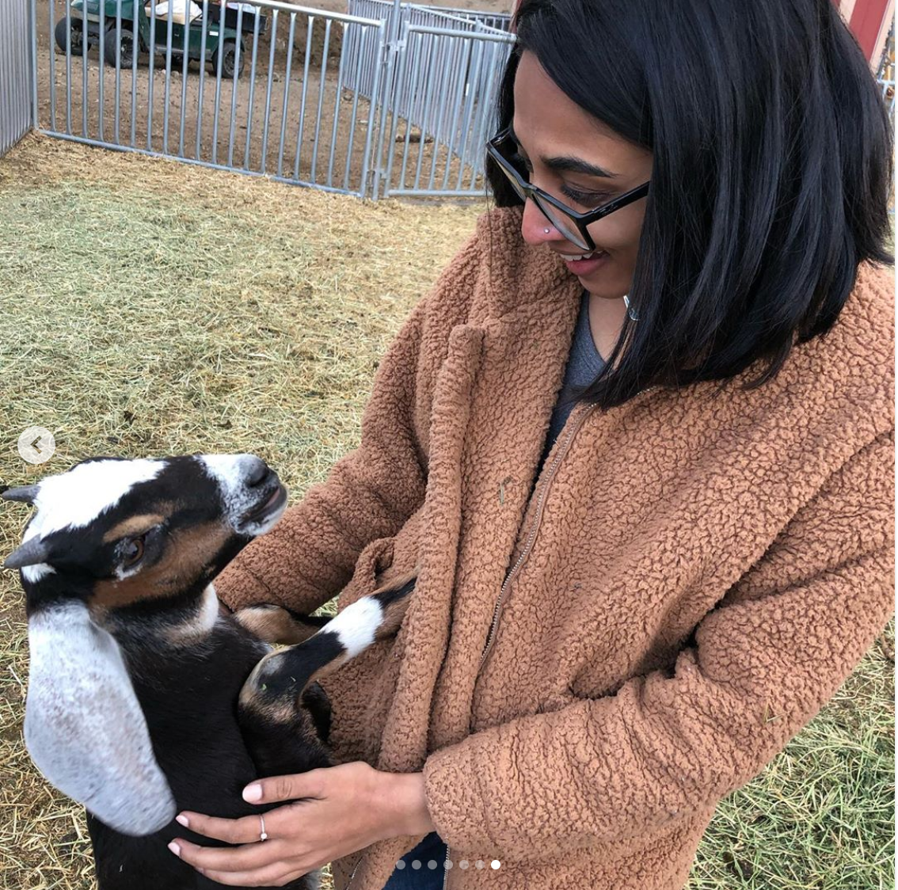

### About me

Hello there! My name is Priyanka Srinivasan, a second year MPH Biostatistics student at Columbia University's Mailman School of Public Health. My bottom-line goal here is to learn something new.

Professionally, I'm interested in learning how to use analytical tools to tackle problems within the healthcare system. My current personal obsessions include reading thriller/horror books, taking boxing classes, and playing with animals. For information on my academic and professional experience, feel free to view my [resume](./resume.html). You can find more about the dashboard data and website [here](./about.html).

### Nice things

I don't have any pets of my own, but here is [Rafa](https://www.instagram.com/rafa._nadog/), my uncle's dog, and a silly goat I made friends with this summer.

 
